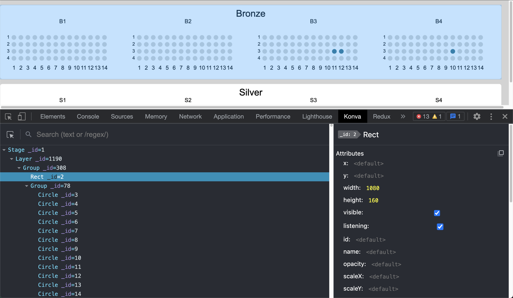

<h1>Konva Devtools</h1>

<a href="https://chrome.google.com/webstore/detail/konvajs-devtools/aleknfecbpmpnkfoaohgpffcjenmjjfi">Chrome Extension</a>

# Thanks
- [pixi-inspector](https://github.com/bfanger/pixi-inspector): which gives me very great idea on how to structure my code
- [react devtools](https://github.com/facebook/react/tree/main/packages/react-devtools): My extension UI is inspired by this

