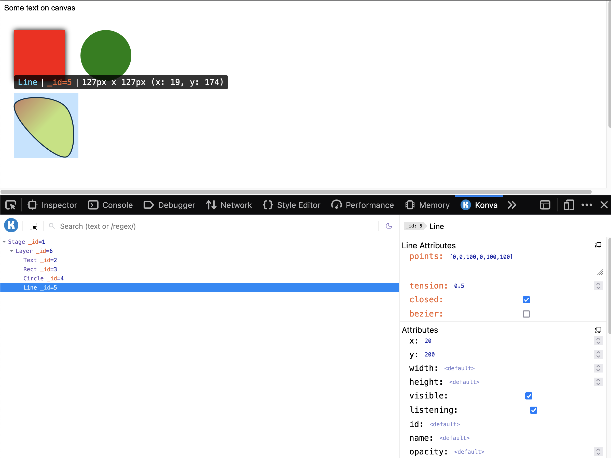
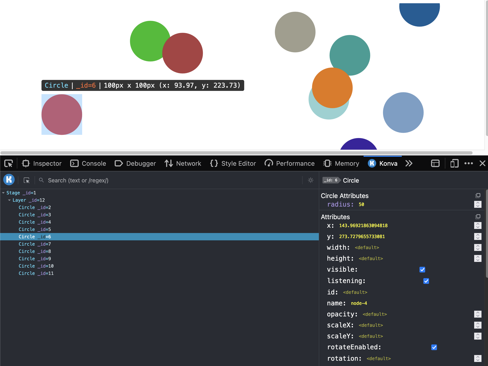
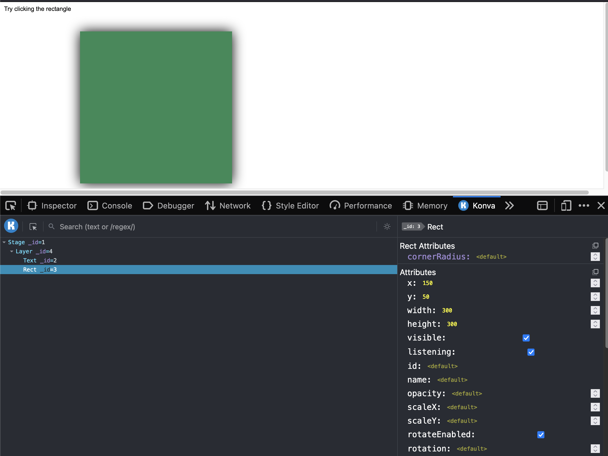

<h1>Konva Devtools</h1>

<a href="https://chrome.google.com/webstore/detail/konvajs-devtools/aleknfecbpmpnkfoaohgpffcjenmjjfi">Chrome Extension</a>
&#x2022;
<a href="https://addons.mozilla.org/vi/firefox/addon/konvajs-devtools/">Firefox Addon</a>

  
  
  
  
  

# Develop
To Develop the extension:
- First clone the project
- Run `yarn install` or `npm install`
- Run `yarn dev` (for Chrome/Edge) or `yarn dev:firefox` for Firefox

Next drag `dist` folder to the following for the browser you're using:

- Chrome: `chrome://extensions/`
- Edge: `edge://extensions/`
- Firefox: `about:debugging#/runtime/this-firefox` > Load Temporary Add > Select any file in the `dist` folder

> Note: for Firefox, to make background script + popup page work on load, right click the Konva extension icon on browser bar -> Always allow....

# Build
To build project for publish, run `yarn build` (for Chrome/Edge) or `yarn build:firefox` for Firefox

# Architecture
## Overview

| Module            | File                                                       | Description                                                                                                                                                                                                                                                                                                                                             | Screenshot                                                              |
|-------------------|------------------------------------------------------------|---------------------------------------------------------------------------------------------------------------------------------------------------------------------------------------------------------------------------------------------------------------------------------------------------------------------------------------------------------|-------------------------------------------------------------------------|
| background_script | [pages/background/index.ts](src/pages/background/index.ts) | Background script runs in background, used to receive detection result from content_script, and update extension icon from black to blue (if Konva is found)                                                                                                                                                                                            |  |
| content_script    | [pages/content/index.ts](src/pages/content/index.ts)       | Content script runs on host page loaded, it has an interval to detect Konva by injecting `detector.ts` to the host page (because content_script doesn't shared same JS runtime with host page) then push message background script to update extension icon. It also receives message for detection request from popup page to detect Konva immediately |                                                                         |
| devtools          | [pages/devtools/index.ts](src/pages/devtools/index.ts)     | Devtools page, which will spawn `panel` for devtools UI. It has an `interval` to keep on detecting Konva from host page until found, and only add `panel` if Konva is found                                                                                                                                                                             |                                                                         |
| panel             | [pages/panel/index.tsx](src/pages/panel/index.tsx)         | React UI for the devtool, details see below                                                                                                                                                                                                                                                                                                             |            |
| popup             | [pages/popup/index.tsx](src/pages/popup/index.tsx)         | React UI for popup page, on click the icon to open the popup page, we send a message to content_script to request detect immediately                                                                                                                                                                                                                    |                    |

## Panel architecture
Panel is jsut a normal React app that renders detected Konva element tree except it has 2 extra parts:
- [devtools](src/pages/panel/devtools/connect.ts): global variables that will be injected to host page at runtime
- [bridge function](src/pages/panel/index.tsx): a function to run execute JS code at host page, it's just a wrapper of `chrome.devtools.inspectedWindow.eval` that returns a Promise

The `devtools` will inject the follow global variables to host page:
- root `__KONVA_DEVTOOLS_GLOBAL_HOOK__`: has some common functions `Konva(), content(), stage()`
- `window.__KONVA_DEVTOOLS_GLOBAL_HOOK__.outline`: helper functions to get Konva object tree
- `window.__KONVA_DEVTOOLS_GLOBAL_HOOK__.selection` helper functions to select/highlight/active/update attributes for Konva object
- `window.__KONVA_DEVTOOLS_GLOBAL_HOOK__.overlay`: function to render a blue highlight box on top of Konva object when highlighting

The `devtools` has a root method `connect` that will convert all the above variables/functions to string then use `bridge` to execute it on the host page

> Note that the `bridge` uses `chrome.devtools.inspectedWindow.eval` requires result of the evaluation expression to be serializable so if it returns something like an instance of a Class then it'll throw error
# Thanks
- [pixi-inspector](https://github.com/bfanger/pixi-inspector): which gives me very great idea on how to structure my code
- [react devtools](https://github.com/facebook/react/tree/main/packages/react-devtools): My extension UI is inspired by this
- [chrome-extension-boilerplate-react-vite
](https://github.com/Jonghakseo/chrome-extension-boilerplate-react-vite): Boiler template project to create Chrome extension

