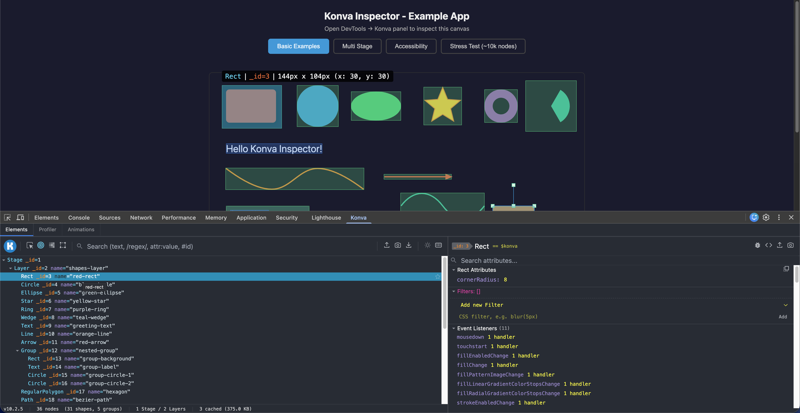

# Konva Devtools

A browser DevTools extension for inspecting and debugging [Konva.js](https://konvajs.org/) canvas applications. Think "React DevTools" but for Konva.



<div align="center">
  <a href="https://chrome.google.com/webstore/detail/konvajs-devtools/aleknfecbpmpnkfoaohgpffcjenmjjfi" target="_blank">Chrome Extension</a> •
  <a href="https://addons.mozilla.org/vi/firefox/addon/konvajs-devtools" target="_blank">Firefox Addon</a> •
  <a href="https://microsoftedge.microsoft.com/addons/detail/konvajs-devtools/noiamlkeehkigdfegcnnfanplidpmeaa" target="_blank">Edge Addon</a>
</div>


## Features

### Elements Tab

- **Scene graph tree** — browse every Stage, Layer, Group, and Shape in a virtualized tree view
- **Attribute editor** — edit any node attribute in place with color pickers and number scrubbing
- **Filter editor** — add, remove, and tweak Konva filters (+ native CSS filters on Konva v10)
- **Select by cursor** — click nodes on the canvas to select them in the tree
- **`$konva` console variable** — the selected node is available as `$konva` in the browser console
- **Event listener inspector** — see all registered event listeners and detect `listening: false` issues
- **Cache inspector** — view cache dimensions/memory, enable or clear cache on any node
- **Change tracking** — snapshot a node's attributes and watch for changes in real time
- **Enhanced search** — search by class name, `/regex/`, `attr:value`, or `#id`
- **Drag-and-drop reorder** — rearrange nodes in the tree to change z-order or reparent
- **Export / Import** — export any stage as JSON, import JSON back into the scene
- **Copy as code** — copy a node as a `new Konva.X({...})` constructor call
- **Hit region visualization** — overlay showing which shapes receive pointer events
- **Render heatmap** — color-coded overlay showing which layers redraw most frequently
- **Scene statistics** — footer bar with node counts, cache memory, and Konva version
- **Dark / light theme** — follows system preference, toggleable

### Profiler Tab

- **Record layer draws** — measure how long each `Layer.draw()` takes
- **Per-layer summary** — average, max, and total draw times with visual bars
- **Recent draws timeline** — table of individual draw events with timestamps

### Animations Tab

- **Live animation monitor** — see all running `Konva.Animation` instances and their target layers
- **Live tween monitor** — see all active `Konva.Tween` instances, their target nodes, and animated properties
- **Auto-cleanup** — stale entries from destroyed stages are automatically filtered out

### Tools

- **Transform gizmo** — toggle a native Konva Transformer on the selected node for interactive resize/rotate/move
- **Screenshot tools** — export the entire stage or just the selected node as a PNG image
- **Keyboard shortcuts** — Arrow keys to navigate, Enter/Escape to select/deselect, Delete to remove, H to toggle visibility, L to toggle listening, Cmd/Ctrl+F to search
- **Bookmark / pin nodes** — pin frequently inspected nodes for quick access (persisted across sessions)
- **Accessibility insights** — flag common issues on interactive nodes: missing names, tiny hit areas, blocked listeners, low opacity, hidden state

### General

- Supports Konva v9 and v10
- Multiple stages supported
- Works on Chrome, Edge, and Firefox

## Develop

```bash
git clone <repo-url>
pnpm install
pnpm dev              # Chrome/Edge dev mode with HMR
pnpm dev:firefox      # Firefox dev mode
```

Load the extension from the generated `dist/` folder:

- **Chrome**: `chrome://extensions/` → Enable Developer mode → Load unpacked → select `dist/`
- **Edge**: `edge://extensions/` → Enable Developer mode → Load unpacked → select `dist/`
- **Firefox**: `about:debugging#/runtime/this-firefox` → Load Temporary Add-on → select any file in `dist/`

> For Firefox, right-click the Konva extension icon → "Always allow on..." to enable background script + popup.

### Example App

A local test application is included at `examples/konva-app/`:

```bash
cd examples/konva-app && pnpm install && pnpm dev
```

Four modes: Basic Examples, Multi Stage (with dynamic add/delete stage controls), Accessibility (a11y issue test cases), and Stress Test (~10k nodes).

## Build

```bash
pnpm build            # Chrome/Edge production build
pnpm build:firefox    # Firefox production build
pnpm zip              # Build + zip for store upload
```

## Architecture

See [ARCHITECTURE.md](ARCHITECTURE.md) for a detailed explanation of how the extension works, including the bridge pattern, injected modules, and how each tab (Elements, Profiler, Animations) is implemented.

## Thanks

- [pixi-inspector](https://github.com/bfanger/pixi-inspector) — great reference for structuring a canvas devtools extension
- [React DevTools](https://github.com/facebook/react/tree/main/packages/react-devtools) — UI inspiration
- [chrome-extension-boilerplate-react-vite](https://github.com/Jonghakseo/chrome-extension-boilerplate-react-vite) — boilerplate template
